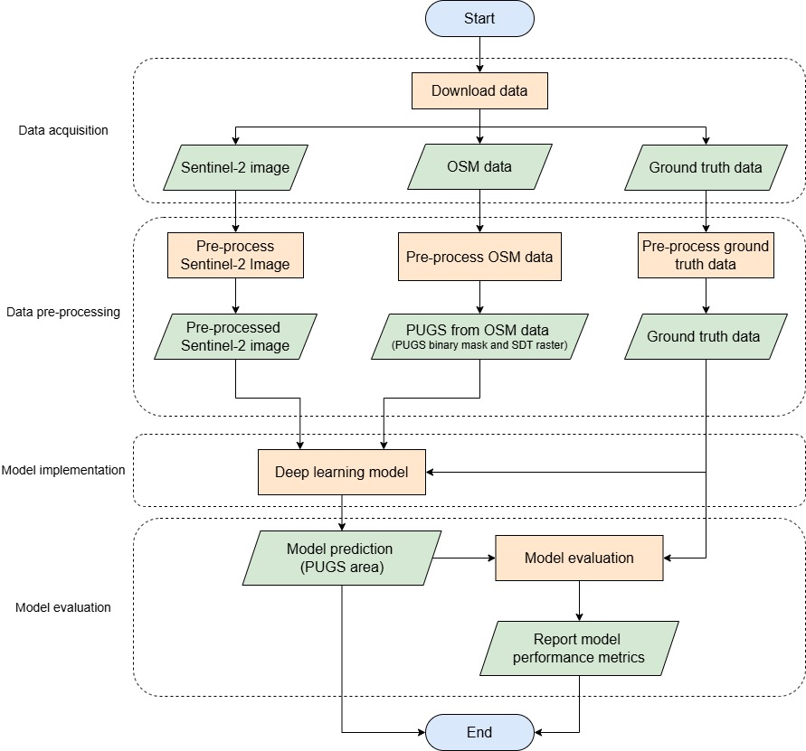

# Public Urban Green Spaces (PUGS) Detection Workflow

<a target="_blank" href="https://cookiecutter-data-science.drivendata.org/">
    
</a>

This project provides a reproducible workflow for PUGS detection, using open-source technology, by integrating Sentinel-2 image and OpenStreetMap (OSM) data with a deep learning method.

The study area in this project is **Dresden, Germany**.

## Overview of the workflow

This workflow encompass from data acquisition to model evaluation step. The final output of this workflow is the **binary mask of PUGS** in the study or target area.



The model architecture used for detecting PUGS is **U-Net with ResNet-50 backbone**. The model used pre-trained weight from [TorchGeo library](https://github.com/microsoft/torchgeo). More details about model training can be found in [Model folder document](/models/README.md).

## Project Organization
```
├── LICENSE             <- Open-source license of the project
├── README.md           <- The top-level README for users.
├── data                <- All input datasets used in the workflow, including both raw data 
│   │                      and processed data generated during data preparation steps
│   ├── processed       <- The intermediate data from raw data processing.
│   └── raw             <- The original, immutable data dump.
│
├── models              <- Trained and serialized (saved) models, model evaluations, and
│   │                      model hyperparameters log
│   ├── checkpoints     <- Best model files and training logs for each experiment
│   └── test_result     <- Model performance metrics from the best model
│
├── notebooks           <- Jupyter notebooks are named using the following convention:
│                          `<step_number>_<short_description>.ipynb`, e.g. `1_data_acquisition_osm`.
│
├── results             <- Results from model prediction
│   ├── clipped_prediction      <- 
│   ├── fn_fp_maps
│   ├── others
│   └── whole_area_prediction
│
├── reports             <- Generated analysis (e.g. HTML, PDF, LaTeX, etc.)
│   ├── figures         <- Generated graphics and figures to be used in reporting
│   └── notebook html   <- Notebooks in HTML format
│   
├── environment.yml     <- The requirements file for reproducing the analysis environment
│
└── pugs_detection      <- Main Python package containing modules and utilities for PUGS detection workflow
    │
    ├── modeling                
    │   ├── __init__.py
    │   ├── model.py                 <- Customized model architecture
    │   ├── predict.py               <- Code to run model inference with trained models          
    │   ├── segmentation_task.py     <- Customized SegmentationTask (customize from torchgeo library)
    │   └── evaluation.py            <- Function to create the confusion matrix
    │
    ├── __init__.py          
    ├── utils.py             <- Common functions used across different notebooks
    ├── dataset.py           <- Dataset classes and dataset creation functions
    ├── ground_truth.py      <- Functions to create features for modeling
    ├── osm.py               <- Functions related to OSM data including loading and processing OSM data
    ├── raster.py            <- Functions to create and process raster data
    └── plots.py             <- Functions to create all visualizations
```

## Datasets
| Main input data      | Source         | Description        | Data License       |
| -------------------- | -------------- | ------------------ | ------------------ |
| Sentinel-2 image | Copernicus Data Space Ecosystem | High-resolution and multi-spectral satellite image. It includes 13 bands and spatial resolution is 10m, 20m, and 60m depending on the wavelength | The data is regulated under EU law (Commission Delegated Regulation (EU) No 1159/2013) which based on a principle of full, open and free access. <br> More details about data policy: [Sentinel-2 Data Policy](https://sentinel.esa.int/documents/247904/690755/Sentinel_Data_Legal_Notice) |
| OSM data | OSM | Areas/polygons related to green spaces, Point of Interest (POI) such as bench, and footpath network | [Open Data Commons Open Database License (ODbL)](https://opendatacommons.org/licenses/odbl/) |
| Ground truth data | European Union's Copernicus Land Monitoring Service (CLMS) | Provide land cover and land use data in Functional Urban Areas (FUA) (This dataset is downloaded by specifying only Dresden area) | The data is regulated under EU law (Commission Delegated Regulation (EU) No 1159/2013) which based on a principle of full, open and free access. <br> More details about data policy: [CLMS Data Policy](https://land.copernicus.eu/en/data-policy) |
| Ground truth data | Dresden Open Data Portal | Datasets related to PUGS | [dl-de/by-2-0](https://www.govdata.de/dl-de/by-2-0) |
| Ground truth data | Author | Manually digitized boundary of Park Zwirnmühle | [CC-BY-4.0](https://creativecommons.org/licenses/by/4.0/) |

More details about input data can be found in [Data folder documentation](/data/README.md)

## Hardware and Software Specifications
Windows Subsystem for Linux (WSL) is used to develop and run the workflow.
```
Host Operating System (OS): Windows 11 (64-bit OS, x64-based processor)
Workflow Environment: WSL2 (Ubuntu 22.04.3 LTS)
CPU: 13th Gen Intel(R) Core(TM) i7-13700H 2.40 GHz
GPU: NVIDIA RTX A500
RAM: 32 GB
Disk storage: 1 TB
```
Conda Version: 24.11.3

## Prerequisites
1. User need to have Conda installed. If user have not installed Conda yet, please visit the [installation guide](https://docs.conda.io/projects/conda/en/stable/user-guide/install/index.html) from Conda.
2. User need to clone this repository or download ZIP file of this repository. To clone the repository, user can use the below command.
    ```
    git clone https://github.com/japanj/pugs-detection.git
    ```

## Set up the environment
1. Create the environment with required dependencies for this project

    ```
    conda env create -f environment.yml
    ```
2. Activate the environment
    ```
    conda activate pugs-detection
    ```
(Optional) User can check all the installed libraries or dependencies by using `conda list` command. 

## Steps to run the workflow
All the notebooks are available in [notebooks folder](/notebooks/). The **number at the beginning of the notebooks' name indicate the order of execution**. Each notebook has different requirements or dependecies which are described in the notebooks.

To get the reproducible result in data processing till model evaluation result step, user can skip the data acquisition notebooks (`1_data_acquisition_ground_truth.ipynb`, `1_data_acquisition_osm.ipynb`, and `1_data_acquisition_satellite_image.ipynb`) since there might be a chance the **different data retrieving time** can lead to slightly different dataset, e.g. OSM data.

More details about notebooks folder, please visit [notebooks folder document](/notebooks/README.md)

## Results
The result of different model training experiments are shown in the table below. To see the detail of Model experiment setup, please visit [Model Experiment Setup document](/models/README.md#model-experiment-setup).
| Version folder | input  | Loss function | Jaccard index (IoU) | Precision | Recall | F1 score | Accuracy |
| -------------- | ------ | ------------- | ------------------- | --------- | ------ | -------- | -------- |
| version_0 | 1. Sentinel-2 image | Jaccard loss | 0.7724 | 0.8949 | 0.8495 | 0.8716 | 0.9614 |
| **version_1** | **1. Sentinel-2 image** <br> **2. PUGS binary mask derived from OSM** | **Jaccard loss** | **0.7767** | 0.9058 | 0.8449 | **0.8743** | 0.9625 |
| version_2 | 1. Sentinel-2 image <br> 2. SDT raster | Jaccard loss | 0.7652 | 0.8910 | 0.8442 | 0.8670 | 0.96 |
| version_3 | 1. Sentinel-2 image | BCE | 0.7546 | 0.8963 | 0.8268 | 0.8601 | 0.9585 |
| version_4 | 1. Sentinel-2 image <br> 2. PUGS binary mask derived from OSM | BCE | 0.7596 | 0.9159 | 0.8165 | 0.8633 | 0.9601 |
| version_5 | 1. Sentinel-2 image <br> 2. SDT raster | BCE | 0.7483 | 0.8821 | 0.8315 | 0.8560 | 0.9568 |
| version_6 | 1. Sentinel-2 image | Focal loss | 0.7209 | 0.8622 | 0.8148 | 0.8378 | 0.9513 |
| version_7 | 1. Sentinel-2 image <br> 2. PUGS binary mask derived from OSM | Focal loss | 0.7409 | 0.8865 | 0.8186 | 0.8512 | 0.9558 |
| version_8 | 1. Sentinel-2 image <br> 2. SDT raster | Focal loss | 0.7259 | 0.8818 | 0.8041 | 0.8412 | 0.9531 |

*BCE = Binary Cross Entopy*

Based on the results, the best-performing model uses Sentinel-2 imagery together with a PUGS binary mask derived from OSM as an input and trained with Jaccard loss function.

### Example of the results
These are examples of model prediction outputs from the best-performing model among all experiments.


For the full details of model prediction output, please visit [results folder](/results/).

## License
It can be separated into three sections:
1. This repository is released under [MIT License](/LICENSE).
2. The data used in this project is under various licenses. Please visit [Data license section](/data/README.md#data-license) to see more detail about license of data used in this project.
3. The model weights, prediction output, and all figures are licensed under [CC-BY-4.0](https://creativecommons.org/licenses/by/4.0/legalcode.en).

## Contact
If there is any further questions or issues related to work, please feel free to open an issues in GitHub or contact m.p.likitpanjamanon@student.utwente.nl