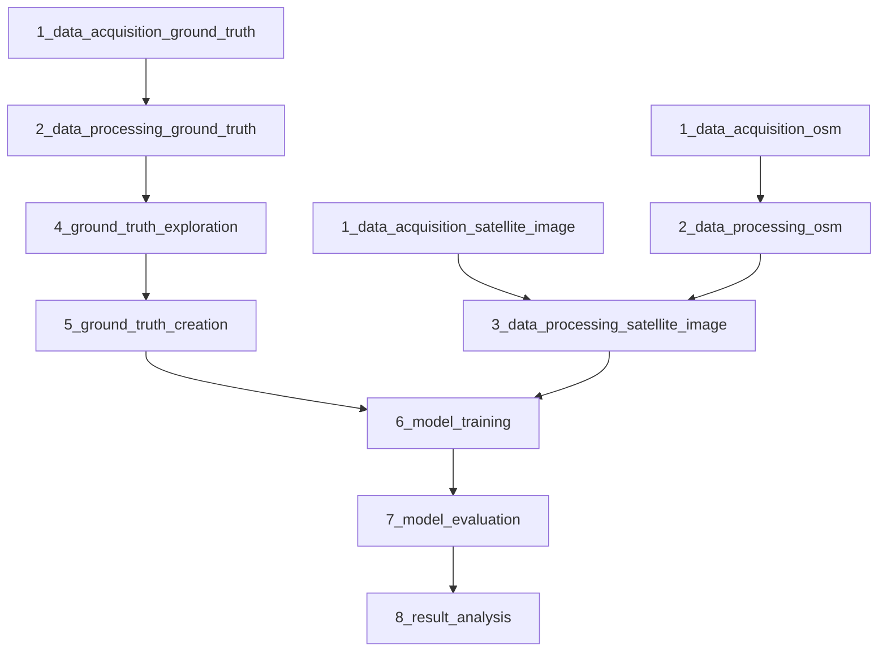

# notebooks folder

This folder contains Jupyter notebooks for each step of the Public Urban Green Spaces (PUGS) detection workflow.

## Workflow Diagram
A diagram shows the recommended execution order and dependencies between the notebooks.

## How to execute the notebooks
- Follow the notebook numbering for the recommended execution order (naming convention of notebook is `<step_number>_<short_description>.ipynb`)
- **For exact reproduction of results:** Use only the raw data provided in `data/raw/` folder
  - Running the data acquisition notebooks with new downloads might lead to different results from reported metrics as data might change over time (e.g. OSM data)

## Data Locations
- Input and output data for these notebooks are stored in the top-level `data` folder.
- For details on the all data used in this project, see [Data folder document](../data/README.md).

## Notebook List
| Notebook name         |  Description           |
| --------------------- |  --------------------- |
| 1_data_acquisition_ground_truth.ipynb | Download ground truth datasets |
| 1_data_acquisition_osm.ipynb | Download the OpenStreetMap (OSM) data |
| 1_data_acquisition_satellite_image.ipynb | Download Sentinel-2 image |
| 2_data_processing_ground_truth.ipynb | Pre-process the ground truth datasets before ground truth exploration and creation steps |
| 2_data_processing_osm.ipynb | Derive public urban green space (PUGS) from OSM data |
| 3_data_processing_satellite_image.ipynb | Pre-process Sentinel-2 image and stack additional raster derived from OSM data with Sentinel-2 image |
| 4_ground_truth_exploration.ipynb | Explore all ground truth dataset to make a decision on which ground truth datasets should be used to create single ground truth dataset |
| 5_ground_truth_creation.ipynb | Create single ground truth dataset |
| 6_model_training.ipynb | Train the model |
| 7_model_evaluation.ipynb | Evaluate the model performance and save the output from model prediction |
| 8_result_analysis.ipynb | Further prediction result analysis |

## Change the parameters

### Model experiments related parameters

To test different [model experiments](/models/README.md#model-experiment-setup), you need to change the value of the parameters in [config.yaml](/config.yaml).

1. **Model training** (run `6_model_training.ipynb`)

    You need to update the following parameters in config file:
    - `band_list`: input channels (Sentinel-2: 0-12, PUGS binary mask derived from OSM: 13, SDT: 14)
    Example: 
        - Sentinel-2 image as input: `band_list = [0, 1, 2, 3, 4, 5, 6, 7, 8, 9, 10, 11, 12]`
        - Sentinel-2 image + binary mask as input: `band_list = [0, 1, 2, 3, 4, 5, 6, 7, 8, 9, 10, 11, 12, 13]`
        - Sentinel-2 image + SDT as input: `band_list = [0, 1, 2, 3, 4, 5, 6, 7, 8, 9, 10, 11, 12, 14]`
    - `loss_func`: loss function ('bce', 'focal', 'jaccard')

2. **Model evaluation** (run `7_model_evaluation.ipynb`)

    You need to update the following parameters in config file:
    - `band_list`: input channels (Sentinel-2: 0-12, PUGS binary mask derived from OSM: 13, SDT: 14)  
    Example: 
        - Sentinel-2 image as input: `band_list = [0, 1, 2, 3, 4, 5, 6, 7, 8, 9, 10, 11, 12]`
        - Sentinel-2 image + binary mask as input: `band_list = [0, 1, 2, 3, 4, 5, 6, 7, 8, 9, 10, 11, 12, 13]`
        - Sentinel-2 image + SDT as input: `band_list = [0, 1, 2, 3, 4, 5, 6, 7, 8, 9, 10, 11, 12, 14]`
    - `version`: version number regarding to model experiments 

### Speed up model training parameters

You can adjust the following parameters to optimize training performance on your system:

- `training_num_workers`: Number of workers to load training data
- `validation_num_workers`: Number of workers to load validation data
- `test_num_workers`: Number of workers to load the test data
- `accelerator`: Computation device ("cpu" or "gpu")

**Note:**
- To set number of workers, please see the recommendation from [Pytorch lightning documentation](https://lightning.ai/docs/pytorch/stable/advanced/speed.html#num-workers).
- To set *gpu* as accelerator, please make sure that **CUDA** is already installed.
- Changing these hardware-related parameters may optimize training speed but **does not guarantee** identical model performance metrics and prediction output. 

## Note
- In the data acquisition notebooks, some data sources require users to have an account in order to download data and some dataset require users to download them manually. All details are listed inside the notebooks.
- When you run the model training step (`6_model_training.ipynb`), it will automatically create a new versioned folder in `models/trained_models/` to store metrics and checkpoints. For example, if versions 0-8 already exist (containing my predefined model experiments), your first run will create `version_9/`.
- Model training step can take up **1-2 hours** to complete (The estimated time is based on author's laptop hardware and hardware configuration setup in [config.yaml](/config.yaml)).