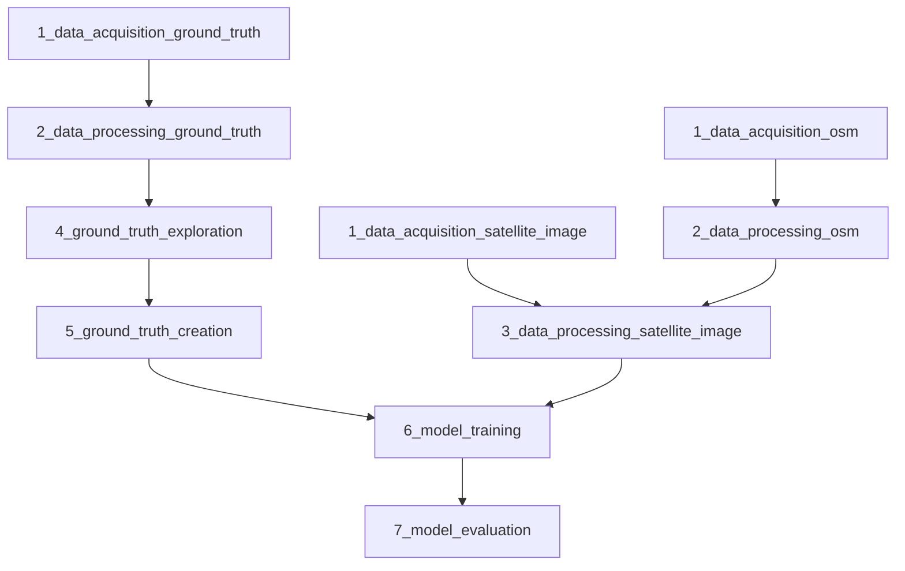

# Notebooks folder

This folder contains Jupyter notebooks for each step of the Public Urban Green Spaces (PUGS) detection workflow.

## Workflow Diagram
A diagram shows the recommended execution order and dependencies between the notebooks.

## How to execute the notebooks
- Follow the notebook numbering for the recommended execution order (naming convention of notebook is `<step_number>_<short_description>.ipynb`)
- Data Acquisition notebooks can be skipped and user can use the provided raw data to get the reproducible result in data processing till model evaluation result step.

## Data Locations
- Input and output data for these notebooks are stored in the `../data/` folder.
- For details on the data structure and file organization, see `../data/README.md` (change to link).

## Notebook List
| Notebook name         |  Description           |
| --------------------- |  --------------------- |
| 1_data_acquisition_ground_truth.ipynb | Download ground truth datasets |
| 1_data_acquisition_osm.ipynb | Download the OpenStreetMap (OSM) data |
| 1_data_acquisition_satellite_image.ipynb | Download Sentinel-2 image |
| 2_data_processing_ground_truth.ipynb | Pre-process the ground truth datasets before ground truth exploration and creation steps |
| 2_data_processing_osm.ipynb | Derive public urban green space (PUGS) from OSM data |
| 3_data_processing_satellite_image.ipynb | Pre-process Sentinel-2 image and stack additional raster derived from OSM data with Sentinel-2 image |
| 4_ground_truth_exploration.ipynb | Explore all ground truth dataset to make a decision on which ground truth datasets should be used to create single ground truth dataset |
| 4_ground_truth_creation.ipynb | Create single ground truth dataset |
| 5_model_training.ipynb | Train the model |
| 6_model_evalution.ipynb | Evaluate the model performace and save the output from model prediction |

## Note
In the data acquisition notebooks, some data sources require users to have an account in order to download data and some dataset require users to download them manually. All details are listed inside the notebooks.